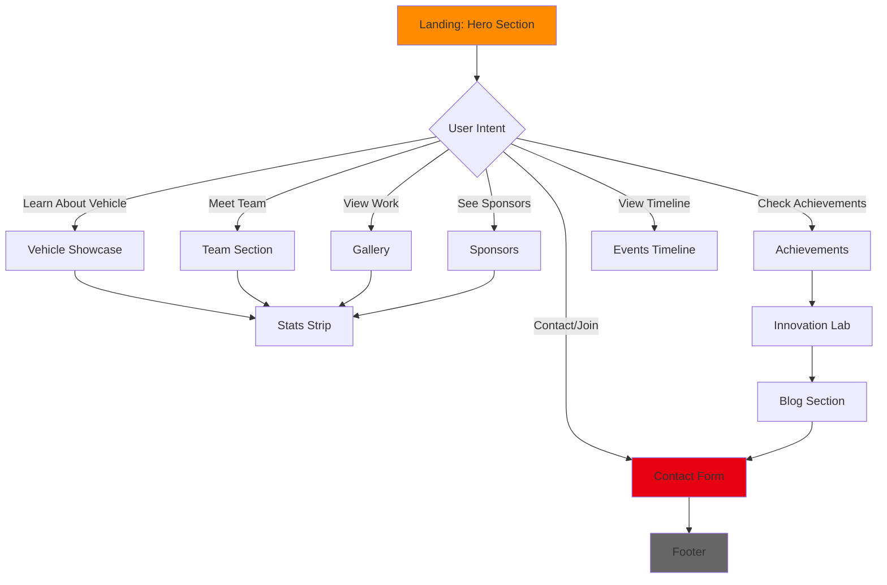

# Team Piratez Racing - Website Architecture Documentation

## 📋 Table of Contents
1. [Overview](#overview)
2. [Design Theme](#design-theme)
3. [Architecture](#architecture)
4. [UI/UX Flow](#uiux-flow)
5. [Component Breakdown](#component-breakdown)
6. [Design System](#design-system)
7. [Interactive Features](#interactive-features)
8. [Performance Optimizations](#performance-optimizations)

---

## 🎯 Overview

**Team Piratez Racing** is a high-performance, single-page racing team website showcasing the TPR 07 go-kart, team achievements, and recruitment opportunities. The website emphasizes speed, innovation, and premium racing aesthetics.

### Key Characteristics
- **Type**: Single Page Application (SPA)
- **Theme**: Racing, Speed, Innovation, Championship
- **Target Audience**: Racing enthusiasts, potential sponsors, team recruits
- **Primary Goal**: Showcase team excellence and attract partnerships

---

## 🎨 Design Theme

### Visual Identity

#### Color Palette
The website uses a **Flame Theme** with racing-inspired colors:

| Color Category | Hex Code | Usage |
|---------------|----------|-------|
| **Primary Orange** | `#FF8C00` | Primary accents, CTAs, highlights |
| **Light Orange** | `#FFA500` | Gradients, hover states |
| **Dark Orange** | `#CC7000` | Shadows, depth |
| **Primary Red** | `#E60012` | Racing accents, borders |
| **Dark Red** | `#B30010` | Backgrounds, depth |
| **Light Red** | `#FF1A2F` | Highlights |
| **Yellow Accent** | `#FFD700` | Premium highlights |
| **Bright Yellow** | `#FFED4E` | Glow effects |
| **Black** | `#0A0A0A` | Primary background |
| **Dark Gray** | `#1A1A1A` | Secondary backgrounds |
| **Medium Gray** | `#2A2A2A` | Card backgrounds |
| **Light Gray** | `#666666` | Text, borders |
| **White** | `#FFFFFF` | Primary text |

#### Gradients
```css
--gradient-flame: linear-gradient(135deg, #FFD700 0%, #FF8C00 50%, #E60012 100%)
--gradient-dark: linear-gradient(135deg, #1A1A1A 0%, #0A0A0A 100%)
--gradient-glow: radial-gradient(circle, rgba(255, 140, 0, 0.3) 0%, transparent 70%)
```

#### Typography
- **Display Font**: `Orbitron` - Used for headings, titles, and branding
  - Characteristics: Futuristic, bold, technical
  - Weights: 400-900
- **Body Font**: `Rajdhani` - Used for body text and descriptions
  - Characteristics: Clean, readable, modern
  - Weights: 300-700

### Design Principles

1. **Glassmorphism**: Frosted glass effects with backdrop blur
2. **Neon Glow**: Orange/red glow effects for emphasis
3. **Motion**: Speed lines, parallax scrolling, animated particles
4. **3D Effects**: Card tilt interactions, depth with shadows
5. **Premium Feel**: High contrast, bold typography, smooth animations

---

## 🏗️ Architecture

### File Structure
```
Website-Piratez/
├── index.html          # Main HTML structure
├── styles.css          # Complete styling system
├── script.js           # Interactive functionality
├── logo/               # Brand assets
│   ├── team piratez Transparent.png
│   ├── team piratez logo.png
│   └── team piratez logo1.png
├── images/             # Content images
│   └── kart-showcase.jpg
├── docs/               # Documentation
│   └── UI.md
├── vercel.json         # Deployment config
├── DEPLOYMENT.md       # Deployment guide
└── README.md           # Project overview
```

### Technology Stack

| Layer | Technology | Purpose |
|-------|-----------|---------|
| **Structure** | HTML5 | Semantic markup |
| **Styling** | Vanilla CSS | Custom design system |
| **Interactivity** | Vanilla JavaScript | Animations, interactions |
| **Fonts** | Google Fonts | Orbitron, Rajdhani |
| **Deployment** | Vercel | Static hosting |

### Architecture Pattern

**Component-Based Single Page Application**
- Modular sections with independent styling
- Scroll-based navigation
- Progressive enhancement
- Mobile-first responsive design

---

## 🔄 UI/UX Flow

### User Journey Map



### Navigation Flow

1. **Fixed Navigation Bar**
   - Always accessible
   - Active link highlighting based on scroll position
   - Mobile hamburger menu for responsive design

2. **Scroll-Based Progression**
   - Hero → Stats → Vehicle → Team → Gallery → Sponsors → Achievements → Events → Innovations → Blog → Contact → Footer

3. **Call-to-Action Points**
   - Hero: "See TPR 07" + "Join the Crew"
   - Sponsors: "Become a Sponsor"
   - Innovations: "View All Innovations"
   - Contact: "Send Message" + "Apply Now"

### Interaction Patterns

| Pattern | Implementation | Purpose |
|---------|---------------|---------|
| **Hover States** | Transform, glow, color change | Visual feedback |
| **Scroll Reveals** | Fade-in + slide-up animations | Progressive disclosure |
| **Parallax** | Hero content moves slower than scroll | Depth perception |
| **Counter Animation** | Numbers count up when visible | Engagement |
| **3D Tilt** | Cards rotate on mouse movement | Premium feel |
| **Smooth Scroll** | Eased anchor navigation | Polished experience |

---

## 🧩 Component Breakdown

### 1. Navigation Bar
**Location**: Fixed top
**Features**:
- Transparent background with blur
- Orange bottom border
- Logo on left
- 8 navigation links (Home, Vehicle, Team, Gallery, Sponsors, Achievements, Events, Contact)
- Mobile hamburger menu
- Active link highlighting
- Scroll shadow effect

### 2. Hero Section
**Purpose**: First impression, brand identity
**Elements**:
- Large "TEAM PIRATEZ RACING" title with gradient
- Subtitle: "Engineering the Future of Speed"
- Description: "Where Innovation Meets the Track - TPR 07"
- Two CTAs: "See TPR 07" (primary) + "Join the Crew" (secondary)
- Animated background with speed lines
- Parallax scroll effect
- Particle effects (30 floating particles)

### 3. Stats Strip
**Purpose**: Quick metrics showcase
**Layout**: 4-column grid
**Stats**:
- 50+ Team Members
- 25+ Projects Completed
- 15+ Awards Won
- 5+ Years of Excellence
**Features**: Animated counter on scroll into view

### 4. Vehicle Showcase (TPR 07)
**Layout**: 2-column grid (image + content)
**Elements**:
- Large kart image with "TPR 07" badge
- Title: "Engineered for Victory"
- Description paragraph
- 4 spec cards (2x2 grid):
  - Engine Power: 15 HP
  - Top Speed: 80 km/h
  - Weight: 145 kg
  - Chassis: Custom
**Effects**: Image zoom on hover, glowing background

### 5. Team Section
**Layout**: 6-column responsive grid
**Teams**:
1. Mechanical Team (🔧)
2. Electronics Team (⚡)
3. Design Team (🎨)
4. Software Team (💻)
5. Racing Team (🏁)
6. Management (📊)
**Features**: Glassmorphism cards, 3D tilt effect, glow on hover

### 6. Photo Gallery
**Layout**: 3-column responsive grid
**Features**:
- Image zoom on hover
- Caption overlay on hover
- Aspect ratio: 4:3
**Current Items**: 3 images (kart, logo, racing action)

### 7. Sponsors Section
**Structure**: Tiered system
- **Gold Sponsors**: 3 placeholders
- **Silver Sponsors**: 4 placeholders
**CTA**: "Become a Sponsor" button
**Features**: Glassmorphism cards, scale on hover

### 8. Events Timeline
**Layout**: Horizontal scrollable timeline
**Events** (5 total):
1. March 2026: National Championship
2. January 2026: TPR 07 Unveiled
3. December 2025: Winter Testing
4. October 2025: Regional Victory
5. June 2025: Innovation Award
**Features**: Scroll snap, orange timeline line, glowing dots

### 9. Achievements Section
**Layout**: 3-column grid
**Achievements**:
1. National Champions 2024 (🏆)
2. Innovation Award (⚡)
3. Best Design 2023 (🎯)
**Features**: Radial glow on hover, tag badges

### 10. Innovation Lab
**Layout**: 2-column grid
**Innovations**:
1. Electric Powertrain (⚙️)
2. Active Aerodynamics (🔧)
**Features**: Image placeholders, technology tags, hover effects

### 11. Blog Section
**Layout**: 3-column grid
**Posts**:
1. Season 2026 Kickoff (Jan 15)
2. AI in Racing (Jan 10)
3. Behind the Pit (Jan 5)
**Features**: Date badges, category tags, read time

### 12. Contact Section
**Layout**: 2-column grid
**Left**: Contact form (name, email, message)
**Right**: Join info card with open roles
- Mechanical Engineers
- Electronics Specialists
- Software Developers
- Design Engineers
**CTA**: "Send Message" + "Apply Now"

### 13. Footer
**Layout**: 3-column grid
**Sections**:
- Logo + tagline
- Quick Links
- Social Media (5 icons)
**Bottom**: Copyright notice

---

## 🎨 Design System

### Spacing Scale
```css
--spacing-xs: 0.5rem   (8px)
--spacing-sm: 1rem     (16px)
--spacing-md: 2rem     (32px)
--spacing-lg: 3rem     (48px)
--spacing-xl: 5rem     (80px)
```

### Typography Scale
```css
h1: clamp(2.5rem, 8vw, 6rem)    /* 40-96px */
h2: clamp(2rem, 5vw, 3.5rem)    /* 32-56px */
h3: clamp(1.5rem, 3vw, 2rem)    /* 24-32px */
```

### Button Variants

#### Primary Button
- Background: Flame gradient
- Color: White
- Glow: Orange
- Hover: Lift + intensify glow

#### Secondary Button
- Background: Transparent
- Border: White 2px
- Hover: White background, black text

#### Outline Button
- Background: Transparent
- Border: Orange 2px
- Hover: Flame gradient + glow

### Card Styles

#### Glass Card
```css
background: rgba(26, 26, 26, 0.7)
backdrop-filter: blur(10px)
border: 1px solid rgba(255, 255, 255, 0.1)
box-shadow: 0 8px 32px rgba(0, 0, 0, 0.37)
```

#### Achievement Card
- Gradient background (dark gray)
- Radial glow on hover
- Icon grayscale → color on hover
- Lift animation

#### Innovation Card
- Dark gray background
- Image placeholder with diagonal stripes
- Technology tags
- Border glow on hover

### Animation Timings
```css
--transition-fast: 0.2s cubic-bezier(0.4, 0, 0.2, 1)
--transition-normal: 0.3s cubic-bezier(0.4, 0, 0.2, 1)
--transition-slow: 0.5s cubic-bezier(0.4, 0, 0.2, 1)
```

### Glow Effects
```css
--glow-orange: 0 0 20px rgba(255, 140, 0, 0.5), 0 0 40px rgba(255, 140, 0, 0.3)
--glow-red: 0 0 20px rgba(230, 0, 18, 0.5), 0 0 40px rgba(230, 0, 18, 0.3)
--glow-yellow: 0 0 20px rgba(255, 215, 0, 0.5), 0 0 40px rgba(255, 215, 0, 0.3)
```

### Responsive Breakpoints
```css
Mobile: max-width: 480px
Tablet: max-width: 768px
Desktop: max-width: 992px
Large: 1400px max container width
```

---

## ⚡ Interactive Features

### JavaScript Functionality

#### 1. Mobile Menu Toggle
- Hamburger icon animation (3 bars → X)
- Slide-in menu from left
- Close on link click

#### 2. Navbar Scroll Effects
- Shadow appears after 100px scroll
- Active link highlighting based on section visibility

#### 3. Animated Counters
- Triggers when stats section enters viewport
- Counts from 0 to target over 2 seconds
- Uses Intersection Observer

#### 4. Scroll Reveal Animations
- Cards fade in and slide up
- Staggered delay (100ms per item)
- Triggers at 10% visibility threshold

#### 5. Parallax Scrolling
- Hero content moves at 0.5x scroll speed
- Hero opacity fades on scroll
- Speed lines move diagonally

#### 6. 3D Tilt Effect
- Team cards and spec cards
- Rotates based on mouse position
- Perspective: 1000px
- Resets on mouse leave

#### 7. Smooth Scroll
- Anchor links scroll smoothly
- 80px offset for fixed navbar

#### 8. Form Handling
- Client-side validation
- Alert on submission
- Form reset after submit

#### 9. Lazy Loading
- Images load when entering viewport
- Uses Intersection Observer
- Data-src attribute pattern

#### 10. Particle System
- 30 particles in hero section
- Random positions and delays
- Float upward animation (15s)

#### 11. Timeline Scroll
- Horizontal scroll with snap points
- Snap to start of each item

#### 12. Easter Egg
- Konami Code detection
- Rainbow hue-rotate animation (5s)

### Performance Features
- Intersection Observer for lazy loading
- RequestAnimationFrame for smooth animations
- Debounced scroll events
- CSS transforms for GPU acceleration

---

## 🚀 Performance Optimizations

### Loading Strategy
1. **Critical CSS**: Inline or prioritized
2. **Font Loading**: Preconnect to Google Fonts
3. **Image Optimization**: Lazy loading with Intersection Observer
4. **JavaScript**: Deferred loading

### Animation Performance
- **GPU Acceleration**: Using `transform` and `opacity`
- **Will-change**: Applied to frequently animated elements
- **RequestAnimationFrame**: For smooth 60fps animations

### Responsive Images
- Aspect ratio boxes prevent layout shift
- Object-fit for consistent sizing

### Code Organization
```css
/* CSS Structure */
1. Reset & Base Styles
2. CSS Variables (Design Tokens)
3. Typography
4. Buttons
5. Navigation
6. Hero Section
7. Stats Strip
8. Section Headers
9. Component Sections (in page order)
10. Utilities (Glassmorphism, Particles)
11. Responsive Media Queries
```

```javascript
/* JavaScript Structure */
1. Mobile Menu Toggle
2. Navbar Scroll Effects
3. Active Navigation
4. Animated Counters
5. Scroll Reveals
6. Smooth Scroll
7. Form Handling
8. Parallax Effects
9. Cursor Trail (optional)
10. Easter Eggs
11. Performance Optimizations
12. Particle Effects
13. 3D Tilt Effects
14. Timeline Features
15. Initialization
```

---

## 📱 Responsive Design

### Mobile (< 480px)
- Logo: 45px height
- Buttons: Smaller padding
- Stats: 2-column grid
- Single column layouts

### Tablet (< 768px)
- Hero: 80vh height
- CTAs: Vertical stack
- Grids: Single column
- Reduced spacing

### Desktop (< 992px)
- Mobile menu activated
- Showcase: Single column
- Contact: Single column
- Innovations: Single column

### Large Screens
- Max container width: 1400px
- Optimal reading width maintained
- Centered content

---

## 🎯 UX Considerations

### Accessibility
- Semantic HTML5 elements
- ARIA labels on social links
- Keyboard navigation support
- Focus states on interactive elements

### User Engagement
- **Visual Hierarchy**: Clear section separation
- **Micro-interactions**: Hover states, animations
- **Progressive Disclosure**: Scroll reveals
- **Feedback**: Form validation, hover effects

### Performance UX
- **Perceived Performance**: Skeleton screens via placeholders
- **Smooth Animations**: 60fps target
- **Fast Load**: Optimized assets

### Brand Consistency
- Consistent color usage
- Unified typography
- Repeated design patterns
- Cohesive visual language

---

## 🔮 Future Enhancements

### Potential Additions
1. **Backend Integration**: Real form submission
2. **CMS**: Dynamic content management
3. **Image Gallery**: Lightbox modal
4. **Video Content**: Team/vehicle videos
5. **Blog System**: Full blog functionality
6. **Multilingual**: i18n support
7. **Dark/Light Mode**: Theme toggle
8. **Analytics**: User behavior tracking
9. **SEO**: Enhanced meta tags, structured data
10. **PWA**: Offline functionality

---

## 📊 Summary

The Team Piratez Racing website is a **premium, performance-focused single-page application** that successfully combines:

✅ **Bold racing aesthetics** with flame gradients and neon glows  
✅ **Modern web technologies** using vanilla HTML/CSS/JS  
✅ **Smooth interactions** with parallax, 3D effects, and animations  
✅ **Responsive design** across all device sizes  
✅ **Clear user journey** from landing to conversion  
✅ **Modular architecture** for easy maintenance  

The design system is **comprehensive and reusable**, with well-defined tokens for colors, spacing, typography, and animations. The component structure is **logical and scalable**, following modern web development best practices while maintaining a unique, high-performance racing identity.
